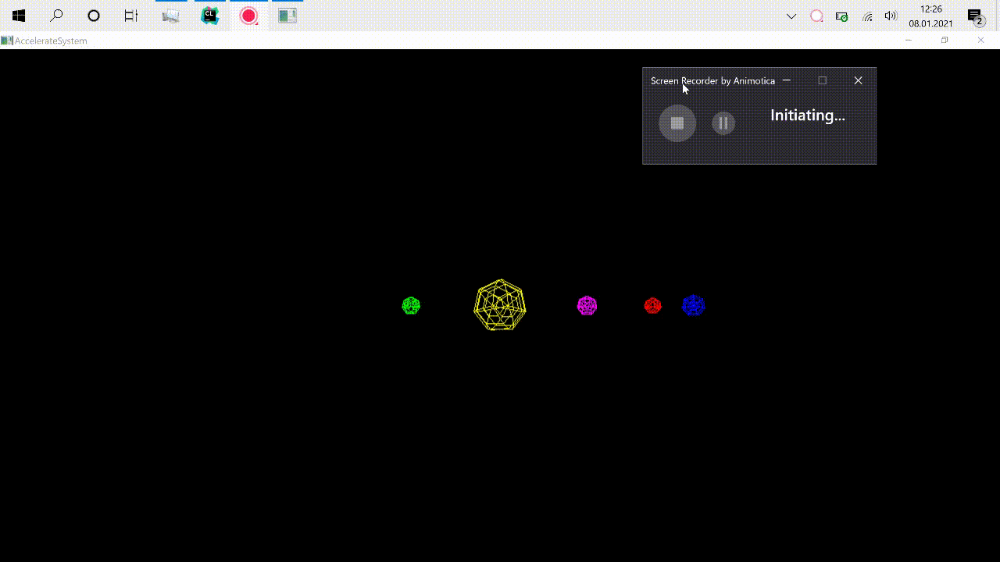
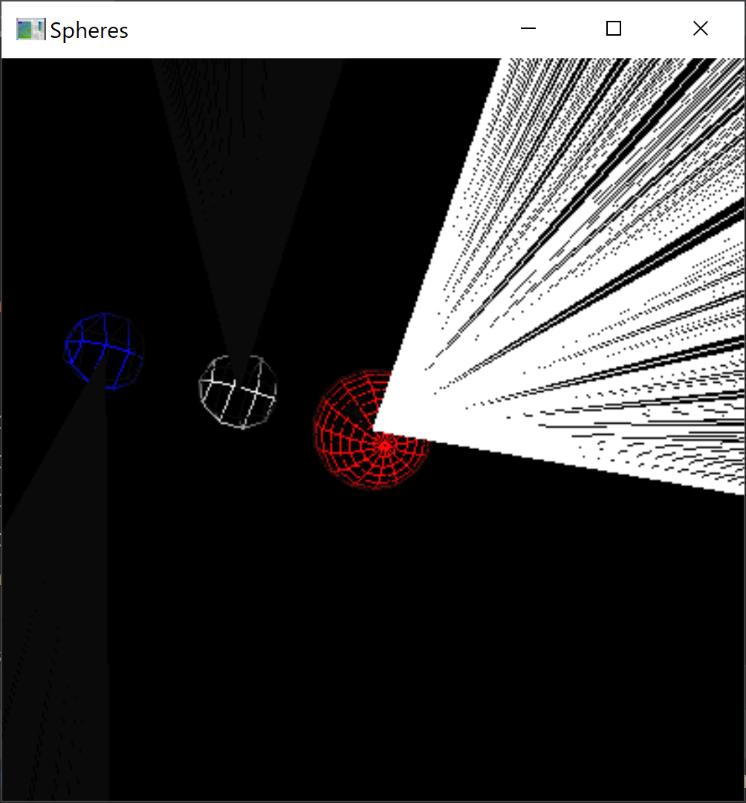
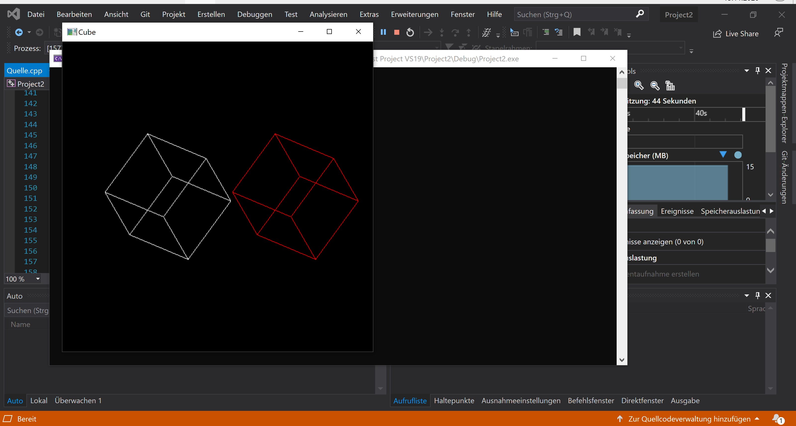

# opengl-projects
Mini projects in computer graphics using OpenGL Utility Library and Toolkit.

### Screenshots and Videos

#### Light Spin Flash 1

#### Light Spin Flash 2

#### Christmas Lights

#### Accelerate System

#### Rotate

#### Solar System

#### Spheres

#### Planets

#### Cube

